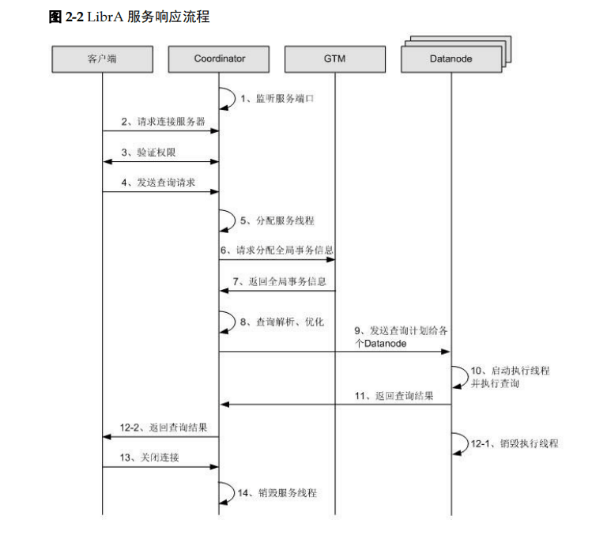

## Pywss - Web Socket Server By Python

一种类似Flask开发的WebSocket-Server服务端框架


 ```安装: pip install pywss```
 
 ### 框架流程图
**[1、流程框架图](https://www.jianshu.com/p/589022ee5f5c)**



### [example1](https://github.com/CzaOrz/Pywss/blob/master/examples/example1.py): 基本的交互实现
**Server** (详情见example1.py)
* 参数简介
    * /test/example/1: 请求路径path
    * request: socket句柄，包括发送和接受数据。 
        * 接受数据 request.ws_recv(1024)
        * 发送数据 request.ws_send(data) 
    * data: 传递过来的数据
* 功能简介
   * 客户端发送数据，服务端立即响应并回复，原数据+指定后缀' - data from pywss'
   * 服务端代码直接用浏览器的控制台就行
```
from pywss import Pyws, route

@route('/test/example/1')
def example_1(request, data):
    return data + ' - data from pywss'

if __name__ == '__main__':
    ws = Pyws(__name__, address='127.0.0.1', port=8866)
    ws.serve_forever()
```
**Client (运行平台: Chrome -> F12 -> console)**
```
ws = new WebSocket("ws://127.0.0.1:8866/test/example/1");
ws.onmessage = function (ev) {
    console.log(JSON.parse(ev.data));
}
ws.onclose = function (ev) {
    console.log('Connect Closed')
}
ws.onopen = function() {
    if (ws.readyState === WebSocket.OPEN) {
        ws.send('hello, pywss!')  // you will get 'hello, pywss! - data from pywss'
    }
}
```
---
### [example2](https://github.com/CzaOrz/Pywss/blob/master/examples/example2.py): 广播中间件的实现
**Server**
* 参数简介
   * RadioMiddleware: 广播中间件，加载此中间件，每当有新的连接建立，都会对其进行广播
* 功能简介
   * 在建立连接后，每隔一定之间，广播数据给所有连接
```
from pywss import Pyws, route, RadioMiddleware

class Radio(RadioMiddleware):
    @classmethod
    def process_data(cls):
        return 'Hello, Welcome To Pywss-Radio'

@route('/test/example/2')
def example_2(request, data):
    """There Nothing To Do"""

if __name__ == '__main__':
    ws = Pyws(__name__, address='127.0.0.1', port=8866)
    ws.add_middleware(Radio)
    ws.serve_forever()
```
**Client**
```
ws = new WebSocket("ws://127.0.0.1:8866/test/example/2");
ws.onmessage = function (ev) {
    console.log(JSON.parse(ev.data));
}
ws.onclose = function (ev) {
    console.log('Connect Closed')
}
```
---
#### [example3](https://github.com/CzaOrz/Pywss/blob/master/examples/example3.py): 认证中间件的实现
**Server**
* 参数简介
    * DaemonMiddleware: 每当连接建立后，会执行且仅执行一次此中间件，可用于对连接的验证等情况
        * 在此example3中，连接建立后，客户端需要发送一次数据进行验证，数据中需要携带 'name'关键字作用用户名，否则此连接无实际作用
* 功能简介
    * 实现基本的验证功能。即建立连接后，客户端仍需发送一次请求数据，来通过对应验证
```
import json
from pywss import Pyws, route, DaemonMiddleware, AuthenticationError

class AuthenticationMiddleware(DaemonMiddleware):
    @classmethod
    def process_input(self, request, input_msg):
        json_data = json.loads(input_msg)
        if 'name' in json_data:
            return str(json_data['name']), 1
        raise AuthenticationError

@route('/test/example/3')
def example_3(request, data):
    """There Nothing To Do"""

if __name__ == '__main__':
    ws = Pyws(__name__, address='127.0.0.1', port=8866)
    ws.add_middleware(AuthenticationMiddleware)
    ws.serve_forever()
```
**Client**
```
ws = new WebSocket("ws://127.0.0.1:8866/test/example/3");
ws.onmessage = function (ev) {
    console.log(JSON.parse(ev.data));
}
ws.onclose = function (ev) {
    console.log('Connect Closed')
}
ws.onopen = function() {
    if (ws.readyState === WebSocket.OPEN) {
        ws.send(JSON.stringify({'name': 'example3'}))  // you will get enter the AuthenticationMiddleware first
    }
}
```
---
#### [example4](https://github.com/CzaOrz/Pywss/blob/master/examples/example4.py): 数据中间件的实现
#### [example5](https://github.com/CzaOrz/Pywss/blob/master/examples/example5.py): 点对点交流的实现
